<div align="center">

<!-- Header com múltiplas animações -->


<!-- Texto animado otimizado para responsividade -->

<div align="center">
  
</div>


<!-- Avatar com efeito hover -->
<br><br>
<br/>


<!-- Badges animados com mais informações -->

<p>
  
  
  
  
  
</p>

<!-- Contador de visitantes animado -->


</div>


🚀 Sobre Mim

<div align="left">


Sou Cientista e Analista de Dados apaixonado por transformar dados brutos em insights estratégicos que impulsionam decisões de negócio. Formado em Engenharia da Computação e atualmente mestrando em Ciência da Computação pela UNESP, com foco especializado em Ciência de Dados e Inteligência Artificial.

🎯 Minha Missão

"Democratizar o poder dos dados, tornando a análise acessível e transformando números em narrativas que geram valor real para organizações e sociedade."

💡 Filosofia de Trabalho

Acredito que a Ciência de Dados é a ponte perfeita entre tecnologia e negócios. Cada projeto é uma oportunidade de descobrir padrões ocultos, prever tendências e criar soluções que fazem a diferença no mundo real.

🔍 Especialidades

•
Modelagem Preditiva para otimização de processos

•
Visualização de Dados interativa e storytelling

•
Machine Learning aplicado a problemas reais

•
Business Intelligence e dashboards executivos

</div>


🛠️ Arsenal Tecnológico

<div align="center">

💻 Linguagens de Programação

<p>
  
  
  
  
  
</p>

🧠 Data Science & Machine Learning

<div style="display: flex; flex-wrap: wrap; justify-content: center; gap: 10px;">
  
  
  
  
  
  
  
  
</div>

📊 Visualização & Business Intelligence

<div style="display: flex; flex-wrap: wrap; justify-content: center; gap: 10px;">
  
  
  
  
</div>

🗄️ Bancos de Dados & Big Data

<div style="display: flex; flex-wrap: wrap; justify-content: center; gap: 10px;">
  
  
  
  

</div>

☁️ Cloud & DevOps

<div style="display: flex; flex-wrap: wrap; justify-content: center; gap: 10px;">
  
  
  
  
</div>

</div>


📊 Estatísticas do GitHub

<div align="center">

<!-- GitHub Stats com tema personalizado -->


<!-- GitHub Streak -->


<!-- Activity Graph -->


</div>


🏆 Conquistas & Reconhecimentos

<div align="center">

<!-- GitHub Trophies -->


<!-- Badges de conquistas -->

<table>
<tr>
<td align="center">

<br><strong>Ciência da Computação</strong>
</td>
<td align="center">

<br><strong>Engenharia da Computação</strong>
</td>
<td align="center">

<br><strong>Análise de Dados</strong>
</td>
</tr>
</table>

</div>


✨ Projetos e Modelagem Setorial

<div align="center">

🚀 Construindo Soluções Orientadas a Dados

Minha paixão reside em desenvolver e implementar modelos de análise de dados que geram valor tangível em diversos setores. Com foco em inovação e aplicabilidade prática, transformo desafios complexos em soluções acionáveis.

<table>
<tr>
<td align="center" width="33%">

<br><strong>🏦 Setor Financeiro</strong>
<br><em>Modelos de risco de crédito, detecção de fraudes, análise de comportamento de pagamento.</em>
</td>
<td align="center" width="33%">

<br><strong>🏥 Saúde</strong>
<br><em>Análise de dados clínicos, modelos preditivos para diagnósticos, otimização de tratamentos, análise epidemiológica.</em>
</td>
<td align="center" width="33%">

<br><strong>🛒 Varejo & E-commerce</strong>
<br><em>Previsão de demanda, análise de cesta de compras, segmentação de clientes, otimização de preços dinâmicos.</em>
</td>
</tr>
<tr>
<td align="center" width="33%">

<br><strong>🏭 Indústria 4.0</strong>
<br><em>Manutenção preditiva de equipamentos, otimização de processos produtivos, controle de qualidade automatizado.</em>
</td>
<td align="center" width="33%">

<br><strong>🎓 Educação</strong>
<br><em>Análise de desempenho estudantil, personalização de aprendizado, predição de evasão escolar.</em>
</td>
<td align="center" width="33%">

<br><strong>🌾 Agronegócio</strong>
<br><em>Otimização de colheitas, análise de solo e clima, previsão de safras, agricultura de precisão.</em>
</td>
</tr>
</table>

🎯 Metodologias Aplicadas

<div style="display: flex; justify-content: center; flex-wrap: wrap; gap: 15px; margin: 20px 0;">
  
  
  
  
</div>

</div>

## 📖 Publicações Científicas Revisadas por Pares (2024–2025)

| Área Temática                       | Título                                                                                                                                                 | Publicação                             | Ano  |
|------------------------------------|--------------------------------------------------------------------------------------------------------------------------------------------------------|-----------------------------------------|------|
| 🏥 Saúde & IA Médica               | *Comparison and Selection of Machine Learning Algorithms for Diabetes Prediction*                                                                     | Revista TH                              | 2024 |
| 🏥 Saúde & IA Médica               | *Predição de Obesidade Baseada em Hábitos Alimentares e Condições Físicas*                                                                            | ResearchGate                            | 2024 |
| ⚡ Cidades Inteligentes & Energia  | *Modelagem e Previsão de Consumo Energético em Ambientes Urbanos: Explorando o Potencial do Machine Learning*                                         | FAPESP Research Grant                   | 2024 |
| ⚡ Cidades Inteligentes & Energia  | *Modelagem e Previsão de Consumo Energético em Ambientes Urbanos* (PT/EN)                                                                             | ResearchGate                            | 2025 |
| ⚡ Cidades Inteligentes & Energia  | *Revisão Sistemática: Otimização da Eficiência Energética com IA*                                                                                      | ResearchGate                            | 2024 |
| 🔧 Manutenção Preditiva            | *Ferramenta de Manutenção Preditiva para Transformadores de Potência*                                                                                  | Revista Contemporânea                   | 2024 |
| 🎓 Tecnologia Educacional         | *Sistema Didático para Correção de Fator de Potência com DL69-2048/D52-2048*                                                                           | Brazilian Journal of Development        | 2024 |
| 📚 Multidisciplinar               | *Capítulo: Machine Learning Aplicado à Saúde (obra coletiva)*                                                                                          | Machine Learning in Healthcare (Livro)  | 2024 |
| 🏥 Saúde & IA Médica               | *Application of Machine Learning Algorithms to the Classification of Anemia Types: A Clinical Data-Driven Approach*                                           | ResearchGate  | 2025 |


🌐 Conecte-se Comigo

<div align="center">

💼 Redes Profissionais

```js
const viniciusContacts = {
  🌟 portfolio: "https://viniciuskanh.github.io/Portfolio-HTML-JS/",
  📧 email: "vinnyciussouza@outlook.com",
  📍 location: "São Paulo, Brazil",
  💼 linkedin: "https://www.linkedin.com/in/vinicius-souza-santoss/",
  🏆 kaggle: "https://www.kaggle.com/viniciuskhan",
  🤗 huggingface: "https://huggingface.co/ViniciusKhan",
  📊 status: "Transformando dados em valor estratégico 24/7",
  🎯 mission: "Democratizando a ciência de dados"
};
```
<!-- Links principais -->

<p>
  <a href="https://viniciuskanh.github.io/Portfolio-HTML-JS/" target="_blank">
    
  </a>
  <a href="https://www.linkedin.com/in/vinicius-souza-santoss/" target="_blank">
    
  </a>
  <a href="mailto:vinnyciussouza@outlook.com" target="_blank">
    
  </a>
</p>

<!-- Links de competições e comunidades -->

<p>
  <a href="https://www.kaggle.com/viniciuskhan" target="_blank">
    
  </a>
  <a href="https://huggingface.co/ViniciusKhan" target="_blank">
    
  </a>
  <a href="https://www.instagram.com/vinnicius_ssantos/" target="_blank">
    
  </a>
</p>

📱 QR Code para Contato Rápido


</div>


📚 Formação Acadêmica & Certificações

<div align="center">

<table>
<tr>
<td align="center" width="50%">

<br><strong>🎓 Mestrado em Ciência da Computação</strong>
<br><em>Universidade Estadual Paulista (UNESP)</em>
<br><strong>Foco:</strong> Ciência de Dados e Inteligência Artificial
<br><strong>Status:</strong> Em andamento
</td>
<td align="center" width="50%">

<br><strong>🎓 Engenharia da Computação</strong>
<br><em>Graduação Completa</em>
<br><strong>Base:</strong> Programação e Sistemas
<br><strong>Status:</strong> Concluído
</td>
</tr>
</table>

🏅 Certificações & Especializações

<div style="display: flex; justify-content: center; flex-wrap: wrap; gap: 10px; margin: 20px 0;">
  
  
  
  
</div>

</div>


🎯 Áreas de Pesquisa & Interesse

<div align="center">

<table>
<tr>
<td align="center" width="25%">

<br><strong>🧠 IA Explicável</strong>
<br><em>Interpretabilidade de modelos complexos</em>
</td>
<td align="center" width="25%">

<br><strong>🤖 AutoML</strong>
<br><em>Automatização de pipelines de ML</em>
</td>
<td align="center" width="25%">

<br><strong>⚖️ IA Ética</strong>
<br><em>Viés algorítmico e fairness</em>
</td>
<td align="center" width="25%">

<br><strong>⚡ Real-time Analytics</strong>
<br><em>Processamento de dados em tempo real</em>
</td>
</tr>
</table>

</div>


🌟 Projetos em Destaque

<div align="center">

<!-- Repositórios em destaque -->

<a href="https://github.com/ViniciusKanh">
  
</a>


<div align="center">

<!-- Contribuições animadas -->

🐍 Contribuições no GitHub


💭 Filosofia de Vida


🎵 Spotify - Coding Playlist

[](https://open.spotify.com/user/12145547877)


📈 Métricas Avançadas




<!-- Footer com wave animation -->


🚀 Sempre em busca de novos desafios e oportunidades de colaboração!

</div>

